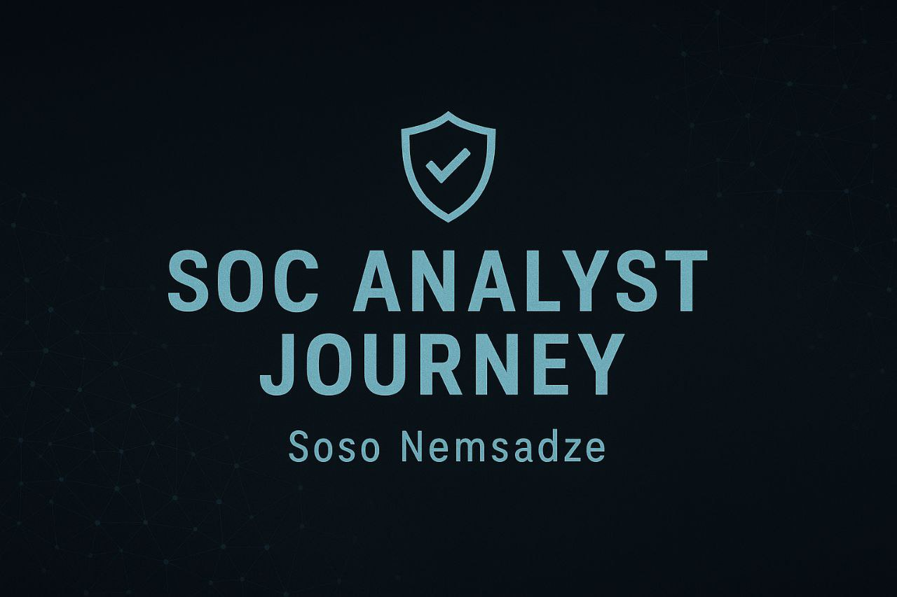

        

# 🛡️ SOC Analyst Journey — Soso Nemsadze

Location: Calgary, Canada 🇨🇦  
Email: [snemsadze@yandex.com](mailto:snemsadze@yandex.com)  
Goal: Aspiring SOC Analyst — mastering network defense, log analysis, and cybersecurity monitoring.  

---

## 🌟 About Me
I’m Soso, an aspiring Security Operations Center (SOC) Analyst based in Calgary.  
My path into cybersecurity started from pure curiosity — I wanted to understand how systems work, how data flows, and how to defend them.  

> “Step by step I move forward. Life is like riding a bike — if you stop, you fall.”

Each command, packet capture, and analysis brings me closer to my goal: to defend systems, understand threats, and protect organizations from digital storms.

---

## 🧰 Skills & Tools
- Operating Systems: Linux (Ubuntu), Windows  
- Networking: TCP/IP, UDP, DNS, HTTP/HTTPS, ICMP  
- Security Tools: Wireshark, Tshark, Syslog, Fail2Ban  
- SOC Practices: Log analysis, Triage, Incident detection  
- Platforms: TryHackMe, IBM SkillsBuild, PortSwigger, ISC2  

---

## 🧩 Learning Roadmap
| Phase | Focus Area | Status |
|-------|-------------|--------|
| Week 1 | Linux Basics & Command Line | ✅ Complete |
| Week 2 | Networking Fundamentals | ✅ Complete |
| Week 3 | Log Analysis & Triage | ✅ Complete |
| Week 4 | Wireshark & Traffic Analysis | ✅ In Progress |
| Week 5 | Threat Detection & Anomalies | ⏳ Upcoming |
| Week 6 | SOC Tools & Automation | ⏳ Upcoming |
| Week 7 | Incident Response & Reporting | ⏳ Upcoming |
| Week 8 | Portfolio, Resume, and Mock Interviews | ⏳ Upcoming |

---

## 📂 Repository Structure
SOC-Analyst-Journey/ │ ├── 🗒️ Notes/                # Study notes and cheat sheets ├── 🧠 Drills/               # Linux, Network, and Log analysis drills ├── 🧾 Artifacts/            # Screenshots, .pcap files, triage templates ├── ⚙️ Projects/             # SOC case files and mini investigations └── README.md

---

## 🧭 Key Areas of Focus
- Network monitoring and threat detection  
- Log correlation and triage investigation  
- Understanding alerts, anomalies, and indicators of compromise  
- Continuous learning through practical drills and analysis  

---

## 📫 Contact
If you’d like to collaborate, mentor, or offer feedback — feel free to reach out:  
📧 [snemsadze@yandex.com](mailto:snemsadze@yandex.com)  

---

## 🚀 Current Mission
> “To become a professional SOC Analyst through discipline, learning, and daily improvement.”  

---
